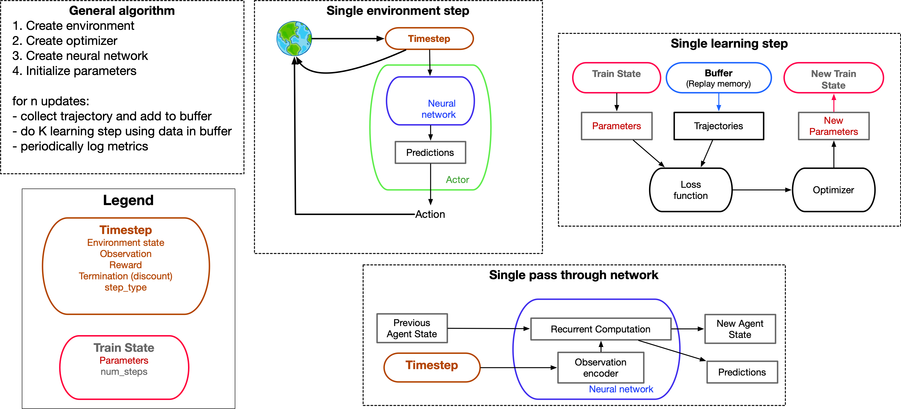

# Install

1. [FAS Install and Setup](install-fas.md)
2. [Local Install and Setup](install.md)

# Single-agent algorithms (all recurrent)

1. [Q-learning](https://openreview.net/forum?id=r1lyTjAqYX) ([code](singleagent/qlearning.py)). This is a Q-learning based agent.
2. [AlphaZero](https://arxiv.org/abs/1712.01815) ([code](singleagent/alphazero.py)). This is a model-based agent that does planning with a ground-truth world model via monte-carlo tree search.


## Overview of algorithms
Below is a schematic of the general learning algorithm used in this [codebase](singleagent/value_based_basics.py).

**Caption:** The learning algorithm works as follows:

1. An environment, optimizer, and neural network are made
   - the environment is typically created in the file that defines training (e.g. [here](singleagent/baselines.py))
   - the optimizer and neural network are typically algorithm-dependent and in the file defining an agent (e.g. [Q-learning](singleagent/qlearning.py)) 
2. The networks parameters are initialized. If the algorithm is value-based (e.g. Q-learning), target parameters are also created.
3. For `n` updates:
   1. A trajectory is collected and added to the buffer.
      - At each time-step, the environment returns a `Timestep` [object](singleagent/basics.py). This is a datastructure, which contains all necessary output from the environment at that timepoint. It contains the observation and reward that the agent will process. Since this is a functional programming paradigm, it will also contain the environment's state, which is passed as input to the environment at the next time-step.
      - This time-step will be processed by the actor. The actor, passes the timestep through the agent's neural network to generate predictions (e.g. Q-values). These predictions are then used by the actor to select actions (e.g. choosing the action with the highest Q-value).
      - A trajectory is just the application of a single environment step `T_traj` times
      - The buffer is a queue (literally) of the last `T_buffer` timesteps (e.g. 1 million time-steps).
   2. The agent then performs `K` learning steps using data in the buffer
   3. One can periodically log acting or learning information via wandb with the [logger](library/loggers.py) datastructure.

--- 
### Defining a new learning algorithm
The easiest way to define a new learning algorithm is to adapt the `make_train` function [value_based_basics](singleagent/value_based_basics.py).
`make_train` is a function which creates a `train_function` which is used to train an algorithm. 
`make_train` accepts as arguments functions for

1. defining the agent's neural network
2. defining the agent's optimizer
3. defining the agent's loss function
4. defining the agent's actor class which selects action in response to observations.

The easiest way to create a novel learning algorithm is to define these functions. You can see an example with Q-learning [code](singleagent/qlearning.py#453).
Note that the common practice in this codebase is to use `functools.partial` to "preload" objects into functions. In this example, we preload the functions that will be used for defining the agent's neural network (`make_rnn_agent`), the agent's optimizer (`make_optimizer`), the agent's loss function (`make_loss_fn_class`), the agent's actor (`make_actor`; here epsilon-greedy), and logger (`make_logger`). You can define your own functions and preload them. 

```
import functools
from singleagent import value_based_basics as vbb

# more imports and definitions

make_train_preloaded = functools.partial(
   vbb.make_train,
   make_agent=make_rnn_agent,
   make_optimizer=make_optimizer,
   make_loss_fn_class=make_loss_fn_class,
   make_actor=make_actor,
   make_logger=make_logger,
)
```


# General todos
1. Replace default LSTM with S5 (maybe [this implementation](https://github.com/facebookresearch/minimax/blob/2ae9e04d37f97d7c14308f5a26237dcfca63470f/src/minimax/models/s5.py#L575)?]
